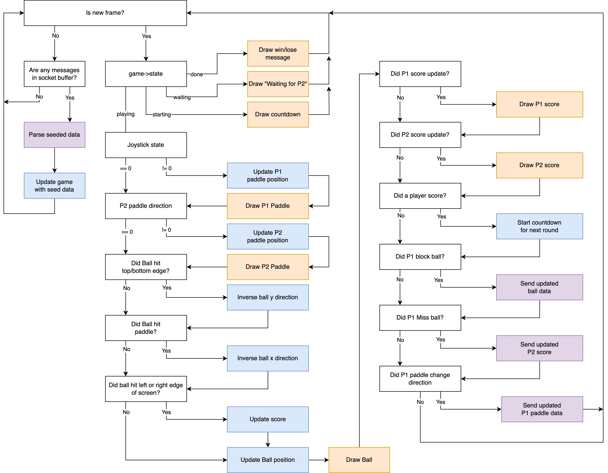

# Multiplayer Pong Game Demo

## Introduction

This project demonstrates an online Pong game that allows players to compete against each other using a custom-built joystick controller and a web client. The game is powered by a CC3200 board and facilitated by a NodeJS server running on an AWS EC2 instance.

## Demo Video
[](https://youtu.be/7d6nEgtiEZs "Demo")


*Figure:  Overall architecture (node server + CC3200 + web client)*

### Gameplay

Pong is a rather straightforward game, so the implementation of its gameplay was also straightforward. We created an FPS.c module that uses an interval timer to create a consistent framerate. Every time the interrupt handler is run, it flips a boolean. The main thread loop uses the edge of that change to determine whether to render the next frame of the game. During an update, we calculate the new position of both paddles and the ball, determine collisions, and any scores, then re-render the view. See figure 3.1 for the overview of updating a single frame.


*Figure 3.1: Gameplay flow*

Beyond the game, we implement a few menu screens to allow the user to select their desired play mode (single or multiplayer) as well as a pause menu and game complete menu.

### Joystick Sensor

In order to navigate the game menus as well as control the game paddle, we opted for a new sensor - the joystick sensor. The module had two data pins that were useful to us; the SW and VRx pins. The VRx pin would output an analog signal that ranged in voltage from 0-5v. In order to read the positional data of the x-axis on the joystick we first needed to convert the analog signals to digital. To do so we used the MCP3001 ADC supplying 5v to VREF and VDD to set the ADC’s range to 0-5v. We then connected the VRx pin on the board to the IN+ pin, the IN- and VSS to ground, the DOUT pin to PIN_06 on the board, and the CS to PIN_04 on the board. When reading data from the ADC, we are reading 2 bytes for the 10-bit value. Based on the datasheet for the ADC, the first 3 bits and the last 3 bits of the 2-byte signal are irrelevant (the 10-bit value is center aligned in the 2-bytes. Also, we are reading the payload into a buffer in sequential bytes, meaning they are written to our buffer out of order (in big-endian). As seen in Figure 3.2a, we need to perform a mask operation to remove the “don’t care” bits from the signal and then perform 2 binary shift operations to put the value in the right order and alignment.


*Figure 3.2a: Diagram of 2-byte binary conversion of ADC signal*

Once we have the correct data format we get a value that ranges from 0-1024 when 0 corresponds to down and 1024 represents up  as seen in Figure 3.2b. Since the center position of the joystick is 512 we subtract the value from the ADC by 512 in order for the center position to be 0. Changing the positional values to be VRx < 0  is down  and and VRx > 0 is up. We also make sure to divide the VRx values by 190 to restrict the paddle speed to values between -2 and +2.. For the Joystick SW we use a GPIO pin read configured as a pull-resistor GPIO  to read when the button is pressed when unpressed = 1 and pressed = 0. 


*Figure 3.2b: Diagram of Joystick Module Values [3]*

#### Joystick Case

For the controller case we were able to find a 3D model for the joystick module [2]. We then used a 3D printer and screws to print the model and assemble it.


*Figure 3.2.1: 3D printed cases for joystick module* 


### Node.js server

To facilitate online gameplay, we first thought that we would have the server run the game and provide data on the position of the ball and paddles to each board. This was quickly abandoned as it would mean the need for a lot of data to be transferred as well and a high potential for less-than-ideal FPS gameplay.

Instead, we decided (in large part because of the simplicity of pong), to run the game independently on each board and sync data related to user-driver input between the boards via a node.js server (written in Typescript for static typing) running on an AWS EC2 instance. This meant each board was running the game autonomously, with the ability to inject game state as it was received.

One reason we chose node.js over other languages was due to the stateful nature of node.js via its volatile state, so there was no need for long-term storage in order to persist the game state from request to request. Variables defined on the server and set from one request would be available in subsequent requests. This was particularly important when pooling open websocket connections for both players, and made it significantly easier to take messages received by one player and forward them to the other player (see sections below).

The main duties of the server include passing gameplay data between the two players (Figure 3.3a), and managing the game state.


*Figure 3.3a: Data flow when P1 syncs positional data to P2*

The server will peek at data being transferred between boards and emit game state changes based on specific events in that data (Figure 3.3b). For example, if either player passes a new score value, the server will emit the state for the next round.


*Figure 3.3b: Data flow when P1 syncs positional data to P2 that also triggers the server to update game state data & positional data*

The other important duty of the server is to facilitate the round countdown, which it manages and sends to each board (Figure 3.3c).


*Figure 3.3c: Data flow when server syncs state & (reset) positional data to P1 & P2*

To reduce the amount of data being sent to each board, the server buffers payloads so they can be combined and deduped. We only buffer for 1 tick of the processor before releasing the payload. This allows the server to more freely update the game state multiple times based on subsets of gameplay data without needing to know what events and data have already or are going to be sent. When the buffer is flushed, all updates are merged, deduped, and sent as a single message.

### WebSocket

It wouldn’t be much of an online multiplayer game without the use of a network protocol to sync gameplay between the two players.

The first decision we made was to use a protocol that supports bi-directional communication over a single TCP connection. It was imperative that the data be able to be pushed to a board rather than rely on the board to request new data. This ruled out the REST endpoints used for our previous lab for our AWS IoT Thing. Next, we needed a protocol that had a very minimal header. Since we will likely be sending data frequently, we did not want to incur the extra cost of an excessive header size (another reason REST was out). Finally, we wanted something that would be easy to implement on our server (which admittedly is not a very high bar as most network protocols are supported in node.js).

With this list of requirements, we ended up with the WebSocket protocol. This gave us the bi-direction communication we desired (with the ability to push updates to clients), and a very small 2-byte header (Figure 3.4a). It also helped that setting up a websocket server in node.js required only a few lines. We only needed to implement the protocol in C for our microcontroller since there was no out-of-the-box support in the CC3200 SDK to implement the WebSocket protocol.

To create a websocket connection, you initially send a GET REST request to the websocket server requesting a WebSocket upgrade via a few headers (Upgrade, Connectio, Sec-WebSocket-Key, and Sec-WebSocket-Version). The response from the server is an upgrade request, and the TCP connection is left open for messages to be pushed back and forth.

A WebSocket message follows a rather simple structure: the first two bytes are the header. This contains information such as the message type, the message payload length, whether the message is masked, and whether this is the final message is a series of fragmented frames (see Figure 3.3c).


*Figure 3.4a: WebSocket 2-byte header format*

For the simplicity of this project (and due to timeline constraints) we opted to omit some security features such as handshake validation. Given more time, these features would have been implemented.

Too, our WebSocket implementation only supports the subset of message operations needed: string and close  messages. We also knew the maximum payload for our string message would be 65 bytes (see Section 3.5), so we did not need to explicitly support message fragmentation (since the max payload of a WebSocket message is 127 bytes).

Our WebSocket payload was a rather straightforward string message (see Figure 3.4b) consisting of a specific syntax for key-value pairs and a separator character.

```string
st:0|c:1|                           // game state
bf:13|bx:22|by:48|bdy:-1|bdx:43|    // ball
pf:34|py:34|pdy:0                   // paddle
```
*Figure 3.4b: Sample payload*

We created a spec (see Figure 3.4c) for a significantly reduced binary format (going from a max of 65-bytes to a max of 12 bytes - over 80% reduction) that uses a similar key-value pattern. In the end, we decided not to implement it as it would have made the observability of messages in real time while debugging the project much more challenging.


*Figure 3.4c: Proposed 12-byte binary payload*

### Seeding Data between Players

There are key events during the gameplay that facilitate the need for data to be synchronized between the players. These types of synchronization fall in two two categories:

1. Player-to-player synchronization (Figure 3.3a)
2. Server-to-player(s) synchronization (Figure 3.3c)

For player-to-player synchronization, this was gameplay data at key player-triggered points:

1. When a player changes the direction of their paddle.
2. When a player blocks the ball.
3. When a player misses the ball.

When a player changes the direction of their paddle, we send both the direction and y position of the paddle (the x position never changes) to the server to sync with the other board. Since the velocity of the paddle is constant, we only need the direction in which it is moving. We send the y position for good measure to ensure that y position is accurate.. When a player blocks the ball with their paddle, we send the position and (new) directional data of the ball to the other player (through the server) This ensures both player’s game state agree on when and where this event took place and the resulting effect it had on the ball’s direction. Finally, when the player misses the ball, we send the updated game score to the server. Since a player’s score is determined by the action of the other player’s paddle, it is the responsibility of each player to report whether the other player scored or not.

For server-to-player synchronization, this was gameplay state data at specific keys points:

1. If one player syncs a score, the server starts the next round and resets the ball.
2. If one player syncs a score that wins the game, the server sets the game state to complete.
3. During round countdown, the server sends the current countdown value as it changes on the server.


### Synchronization

When one player sends the position/directional data for their paddle or ball, the data will (very likely) be received by the other player in a stale state - with the frame that the data applies to being a few frames in the past.

This latency (and need for real time data) causes a few problems. First, applying the received positional data “as-is” caused the ball/paddle to jump back on the screen (see Figure 3.6a).


*Figure 3.6a: Ball location synchronization without projection*

The effect of applying this stale data “as-is” is cumulative - each time stale data is applied, the more and more the players fall out of sync with each other. To mitigate this, we needed a way to identify a payload with a specific point in game time. Since the boards do not have an accurate time applied to them (and there wasn’t a simple sure-fire way to ensure they truly agreed on the current time), we couldn’t rely on including timestamps in these data sync messages. Instead, since both players are operating at the same FPS, we can count frames at the start of every round and provide the frame number with the positional data. When a player receives positional data, they will now receive the frame number that positional data came from. The board then compares it to its own current frame number, and projects the provided positional data back into the current frame (see Figure 3.6b).


*Figure 3.6b: Ball location synchronization with projection*

In a further effort to ensure smooth gameplay, each board assumes the opponent player blocks the ball unless it receives a payload that either confirms this, or a new round is started. This means most of the time when we receive stale position data and project it into the current frame, the location of the ball is at the same location.


### Cross-Platform Gameplay

To facilitate cross-platform gameplay, we create a web-based client for players to play online. This was not part of our original plan, but early in the project we realized it would be difficult to test and debug the online gameplay without have two physical boards connected. This would have required very frequent in-person meetings or remote zoom sessions, but we decided to create a web based client that could act as a second player (see Figure 3.7). 

![]
*Figure 3.7: Web player*

This web based client was nearly a one-for-one conversion of our original C code into typescript, with a few modifications due to platform differences.

### OLED Rendering

Rendering on the OLED screen is a rather slow process, so we leverage some patterns to mitigate this. First, every time we actually render an object (the ball, paddle, score, display text, etc) we capture the position or value of what was rendered. On subsequent updates, we check against these values and only re-render if the values changed since the last render.

When an object moves we also need to erase the previous render. Since we are tracking the previous position data used for rendering, we use that to erase the previous rendering before rending the object at the new location.

For the paddle, it was actually fairly slow to completely erase the entire paddle and redraw it (see Figure 3.8a).


*Figure 3.8a: Paddle rendering*

Instead, we calculate the deltas - the area the paddle is no longer in is erased and the new area the paddle is in is drawn resulting is a much faster re-render (see Figure 3.8b).


*Figure 3.8b: Optimized paddle rendering by erasing/drawing delta*


### Game States


*Figure 3.9: State Diagram*

#### Main Menu
The MainMenu state is the initial state of the game that will render the main menu on the OLED allowing a player to select a singpleplayer game or multiplayer game. The state will check the values of the joystick SW and the X position value. If the player moves the joystick up the OLED will update highlighting the current selection. Once a player presses down on the joystick the screen will begin to transition to the next state. 
####  Singleplayer
If a player selected the singleplayer option it will then initialize the game and render it on the OLED. The state switch to the playing state when finished
####  Multiplayer
When a player selects the multiplayer option from the main menu the game will initialize for multiplayer. The state switch to the playing state when finished
#### Playing
Once the game has been initialized this state will be used to continues run the game logic depending on what is has been initiazled to. It will check the joystick SW value to see if a player has pressed. If the button is pressed it will transition to the paused state.
#### Paused
When a player pause the game it will stop updating the game logic and display the pause menu allowing the player to select resume or quit.
####  Finished
When a game is finished this will be display a menu on the OLED allowing the player to return to main menu.
